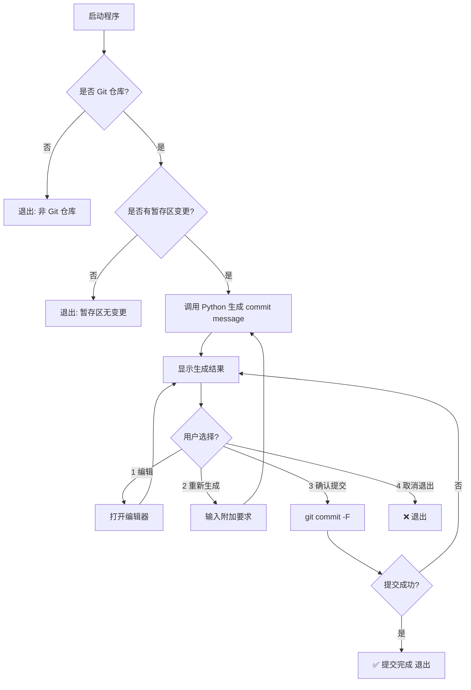

---

# **Rust CLI – Git Commit 助手产品交互文档**

## **1. 产品定位**

一个在 macOS 上运行的纯 CLI 工具，通过调用已有的 Python 脚本（大语言模型接口）分析 Git 暂存区变更，生成符合规范的 commit message，支持预览、编辑、重新生成并最终提交。

---

## **2. 功能清单**

1. **读取暂存区变更**

   * 获取 `git diff --cached` 的内容（或使用 `git2` crate）。
2. **生成 commit message**

   * 调用 Python 脚本，将变更内容与可选提示传入大语言模型，生成 commit message（含标题与正文）。
3. **预览与编辑**

   * 使用系统 `$EDITOR`（或 `--editor` 参数）打开临时文件让用户修改。
4. **重新生成**

   * 用户可附加提示重新生成。
5. **提交 commit**

   * 确认后执行 `git commit -F <tempfile>`。
6. **异常处理**

   * 无变更、Python 脚本失败、Git 提交失败等都有对应提示与回退逻辑。

---

## **3. CLI 参数设计**

| 参数                  | 类型  | 描述                 |
| ------------------- | --- | ------------------ |
| `--editor <editor>` | 字符串 | 覆盖 `$EDITOR`       |
| `--prompt "<text>"` | 字符串 | 附加生成要求             |
| `--dry-run`         | 布尔  | 生成但不提交             |
| `--yes`             | 布尔  | 生成后直接提交（跳过交互）      |
| `--debug`           | 布尔  | 显示 Python 调用的输入与输出 |

---

## **4. 运行交互流程**

### **Step 0 – 启动检查**

1. 检查当前目录是否为 Git 仓库

   * 否 → `Error: 当前目录不是 Git 仓库` → 退出
2. 检查是否有暂存区变更

   * 否 → `Error: 暂存区没有变更，请先运行 git add` → 退出

---

### **Step 1 – 生成初稿**

```text
正在分析已暂存的变更...
已调用大语言模型生成初稿：
--------------------------------------------------
feat: 支持用户预览和重新生成 commit 信息

添加了 CLI 应用基础框架，支持调用 Python 脚本生成 commit 信息
--------------------------------------------------
```

* 若 `--debug` 开启，额外显示：

  ```
  [DEBUG] Python 输入: <diff内容>
  [DEBUG] Python 输出: <commit message>
  ```

---

### **Step 2 – 菜单交互**

```
请选择下一步操作：
[1] 编辑 commit message
[2] 重新生成
[3] 确认并提交
[4] 取消并退出
> 
```

---

### **Step 3 – 菜单行为**

#### **1️⃣ 编辑 commit message**

* 打开 `$EDITOR`（或 `--editor`）
* 等待用户编辑保存
* 读取修改后的文本 → 更新当前 commit message → 返回菜单

---

#### **2️⃣ 重新生成**

* 提示：

  ```
  输入附加生成要求（直接回车跳过）：
  > 使用英文，格式为 Conventional Commit
  ```
* 调用 Python 脚本生成新版本 → 更新当前 commit message → 返回菜单

---

#### **3️⃣ 确认并提交**

* 将当前 commit message 写入临时文件
* 执行：

  ```bash
  git commit -F <tempfile>
  ```
* 成功：

  ```
  ✅ Commit 已提交: feat(auth): add JWT authentication support
  ```
* 退出程序

---

#### **4️⃣ 取消并退出**

```
❌ 操作已取消，未提交任何变更
```

* 退出程序

---

## **5. 异常场景**

| 场景          | 提示                                             | 处理                  |
| ----------- | ---------------------------------------------- | ------------------- |
| 非 Git 仓库    | `Error: 当前目录不是 Git 仓库`                         | 退出                  |
| 暂存区无变更      | `Error: 暂存区没有变更，请先运行 git add`                  | 退出                  |
| Python 调用失败 | `Error: 生成 commit message 失败`<br>`stderr: ...` | 询问 `[R] 重试  [Q] 退出` |
| Git 提交失败    | `Error: git commit 执行失败`<br>`stderr: ...`      | 返回菜单                |

---

## **6. 流程图**



---

## **7. 运行示例**

```bash
$ mycommit
正在分析已暂存的变更...
已调用大语言模型生成初稿：
--------------------------------------------------
feat: 新增用户认证模块

实现了 JWT 鉴权逻辑，并集成到现有 API 流程中
--------------------------------------------------
请选择下一步操作：
[1] 编辑 commit message
[2] 重新生成
[3] 确认并提交
[4] 取消并退出
> 2
输入附加生成要求（直接回车跳过）：
> 使用英文，格式为 Conventional Commit
（生成中...）
--------------------------------------------------
feat(auth): add JWT authentication support

Implemented JWT-based auth and integrated into API flow
--------------------------------------------------
请选择下一步操作：
> 3
✅ Commit 已提交: feat(auth): add JWT authentication support
```

---

